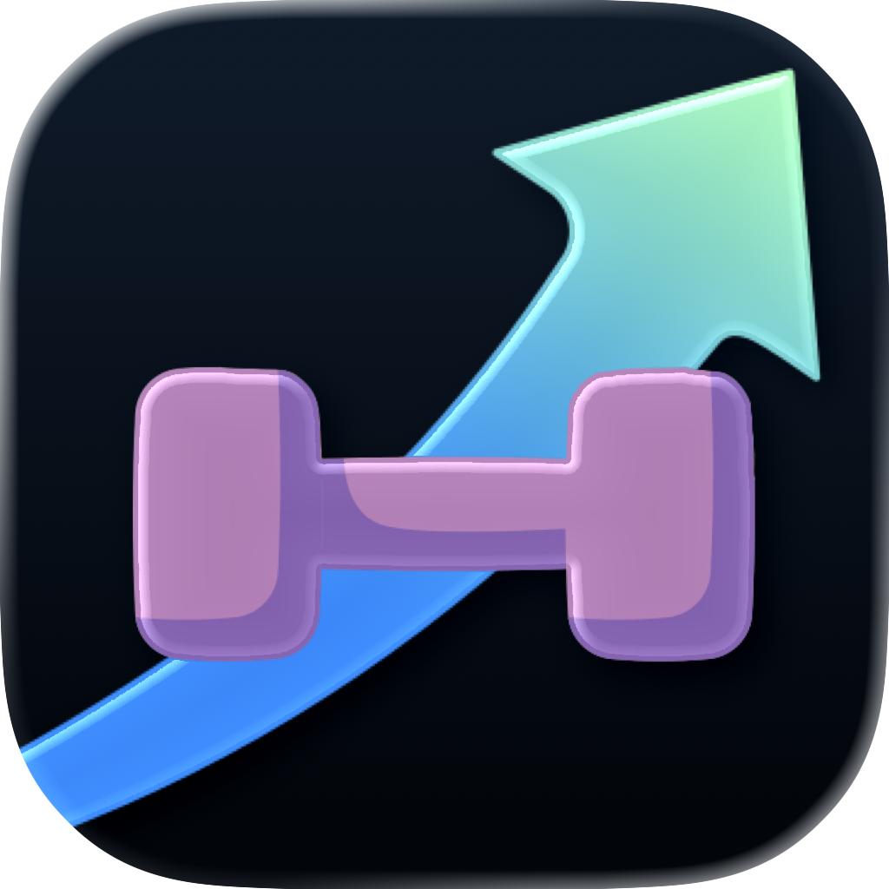
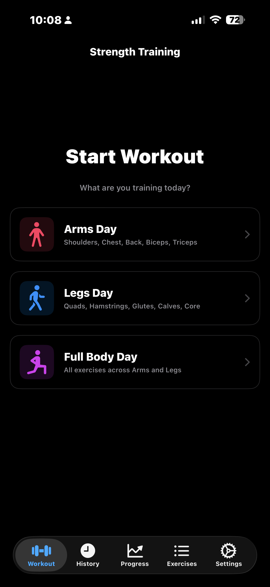
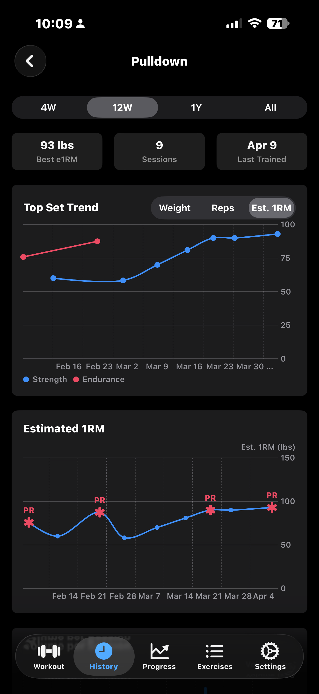
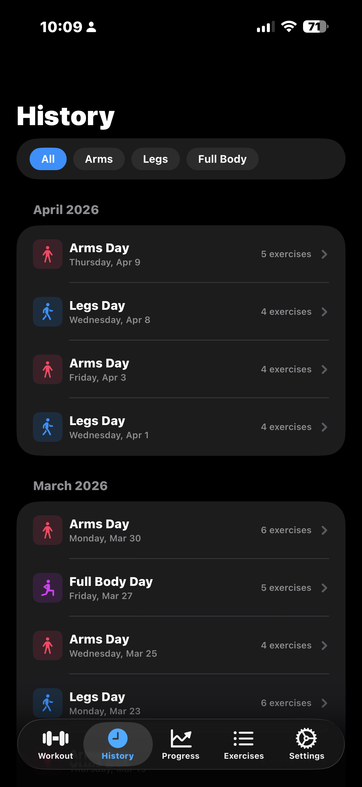
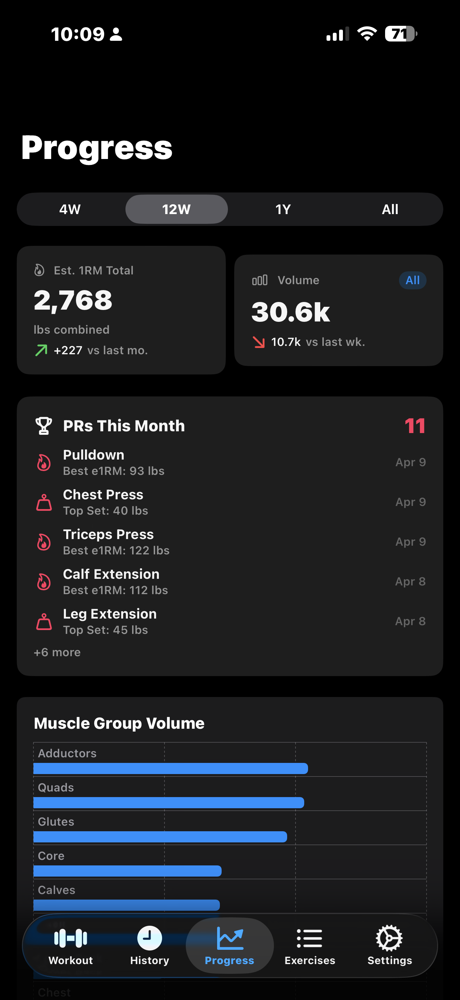
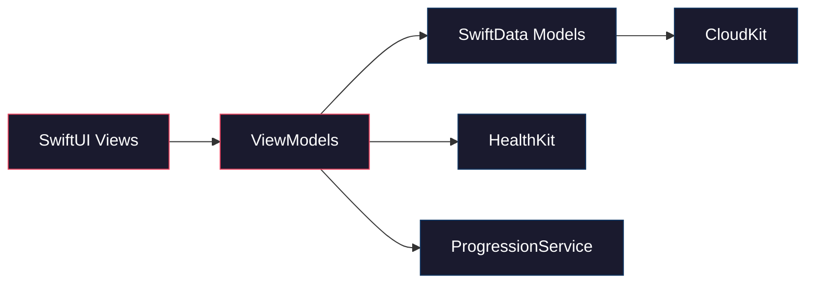

<div align="center">
  
  <h1>UpLift</h1>
  <em>Your gym, your data, your progress.<br>A native iOS workout tracker built with SwiftUI.</em>
  <br><br>

  
  
  
  
</div>

---

> [!NOTE]
> UpLift is a personal project built for my own gym sessions. It tracks sets, reps, and weight across Arms and Legs days, charts your progress over time, and syncs everything to iCloud so you never lose your training history. If you find it useful, feel free to use it, fork it, or contribute.

## Screenshots

<p align="center">
  
  
  
  
</p>

## Features

- **Workout sessions** — start an Arms or Legs day and log exercises as you go
- **Set logging** — record weight and reps with quick increment/decrement controls
- **Training modes** — toggle between Strength (heavy/low reps) and Endurance (light/high reps) per session
- **Last session reference** — automatically surfaces your best set from the previous session so you know what to beat
- **Progressive overload** — built-in progression algorithms suggest your next target weight and reps
- **Exercise library** — 19 built-in exercises across Arms and Legs days, plus support for custom exercises
- **Workout history** — browse past sessions grouped by month, filterable by day type
- **Progress charts** — visualize estimated 1RM trends, top set trends, volume per session, muscle group breakdowns, and mode splits over customizable time ranges
- **Dashboard cards** — PRs this month, strength score, and volume score at a glance
- **HealthKit integration** — automatically starts and stops an Apple Fitness workout when you begin and end a session, with effort rating selection from within the app
- **iCloud sync** — automatic CloudKit data sync keeps your workout history safe and available across all your devices
- **Haptic feedback** — subtle haptic cues for key interactions
- **Offline-first** — all data is stored locally using SwiftData; no account or internet connection required

## How It Works



1. **Views** render the UI and delegate user actions to **ViewModels**
2. **ViewModels** manage state, coordinate business logic, and read/write **SwiftData Models**
3. **SwiftData** persists everything locally and syncs to **iCloud via CloudKit** automatically
4. **HealthKit** integration starts/stops Apple Fitness workouts alongside your in-app sessions
5. **ProgressionService** analyzes your history and suggests next-session targets

## Getting Started

### Prerequisites

- Xcode 16+
- iOS 26.2+
- An Apple Developer account (for signing and running on a real device)

### Build & Run

```bash
# Clone the repo
git clone https://github.com/danielkuhlwein/strength-training.git
cd strength-training

# Open in Xcode
open strength-training.xcodeproj
```

In Xcode, select your **signing team** under the project target's Signing & Capabilities tab, then build and run on a simulator or device.

> **Note:** HealthKit features require a physical device. iCloud sync requires an iCloud account and the CloudKit entitlement — contributors will need to configure their own iCloud container or disable the entitlement for local-only development.

## TestFlight & Beta Testing

UpLift is continuously deployed via **Xcode Cloud**. Every push to `main` triggers an automated build-and-release workflow that distributes a new test build to **TestFlight** for internal testers.

If you'd like to be added to the list of internal beta testers, feel free to [open an issue](https://github.com/danielkuhlwein/strength-training/issues) or reach out directly.

<details>
<summary><strong>Project Structure</strong></summary>

```
strength-training/
├── Models/                        # SwiftData @Model classes
│   ├── Exercise.swift             # Exercise definitions
│   ├── WorkoutSession.swift       # Workout session container
│   ├── ExerciseRecord.swift       # Per-exercise records within a session
│   ├── SetRecord.swift            # Individual set data (weight, reps)
│   ├── Enums.swift                # Shared enumerations
│   ├── ProgressionTypes.swift     # Progression algorithm types
│   ├── BackupModels.swift         # Import/export models
│   └── SeedData.swift             # Default exercise library
├── ViewModels/                    # @Observable state managers
│   ├── WorkoutViewModel.swift     # Active workout logic
│   ├── HistoryViewModel.swift     # History browsing and filtering
│   ├── ProgressDashboardViewModel.swift
│   └── ExerciseDrillDownViewModel.swift
├── Views/
│   ├── Workout/                   # Active workout UI
│   │   ├── WorkoutTabView.swift
│   │   ├── ActiveWorkoutView.swift
│   │   ├── ExerciseRowView.swift
│   │   ├── SetInputView.swift
│   │   ├── EffortRatingView.swift
│   │   ├── TrainingModePickerView.swift
│   │   ├── WorkoutDayPickerView.swift
│   │   └── WorkoutMetricsBannerView.swift
│   ├── History/                   # Past session browsing
│   │   ├── HistoryListView.swift
│   │   └── SessionDetailView.swift
│   ├── Progress/                  # Charts and analytics
│   │   ├── ProgressDashboardView.swift
│   │   ├── ExerciseDrillDownView.swift
│   │   ├── E1RMTrendChart.swift
│   │   ├── TopSetTrendChart.swift
│   │   ├── VolumePerSessionChart.swift
│   │   ├── MuscleGroupVolumeChart.swift
│   │   ├── ModeSplitChart.swift
│   │   ├── PRsThisMonthCard.swift
│   │   ├── StrengthScoreCard.swift
│   │   └── VolumeScoreCard.swift
│   ├── Library/                   # Exercise management
│   │   ├── ExerciseLibraryView.swift
│   │   └── AddExerciseView.swift
│   ├── Settings/                  # App settings
│   │   └── SettingsView.swift
│   └── Components/                # Shared UI components
│       └── ProgressionBanner.swift
├── Services/
│   ├── HealthKitWorkoutService.swift  # Apple Fitness workout integration
│   ├── CloudKitSyncService.swift      # iCloud data sync monitoring
│   ├── ProgressionService.swift       # Overload suggestion algorithms
│   ├── BackupService.swift            # Data import/export
│   └── HapticService.swift            # Haptic feedback engine
├── Utilities/
│   └── PreviewSampleData.swift        # SwiftUI preview data
├── Assets.xcassets/                   # Images, colors, app icon
├── Info.plist
├── PrivacyInfo.xcprivacy
└── strength-training.entitlements
```

</details>

## Contributing

Contributions are welcome! Please follow these guidelines:

- Use **conventional commits** (`feat:`, `fix:`, `refactor:`, etc.)
- Open a **pull request** against `main` — direct pushes are restricted
- Keep PRs focused — one feature or fix per PR
- The project uses MVVM with `@Observable` — see `CLAUDE.md` for architecture details

## License

MIT — do whatever you want with it.
