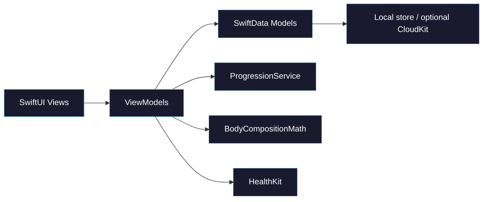

<div align="center">
  
  <h1>IronLog</h1>
  <em>Your gym, your data, your progress.<br>A native iOS strength tracker built with SwiftUI.</em>
  <br><br>

  
  
  
  
</div>

---

> [!NOTE]
> **IronLog** is a personal strength-training app for logging lifts, tracking progressive overload, and watching body-composition trends over time. Data lives on-device by default (SwiftData). Export a JSON backup anytime. Fork it, use it, or contribute if it’s useful to you.

## Screenshots

<p align="center">
  
  
  
  
</p>

## Features

### Training
- **Freeform training splits** — define day types (Push/Pull/Legs, Upper/Lower, custom names) and assign exercises per day
- **Rolling or strict weekly schedule** — advance through the split after each workout, or stick to a Mon–Sun plan
- **Focus workout UI** — log sets with steppers, training mode (strength / endurance), and last-session reference
- **Supersets & multi-exercise flow** — move between exercises in a session without losing place
- **Assisted lifts** — mark sets as assisted (e.g. pull-ups/dips); tonnage uses body weight − assist (never negative)
- **Rest timer** — global defaults plus per-exercise on/off (handy for supersets); optional countdown sounds
- **Progressive overload** — built-in suggestions for next weight/reps from recent history
- **PR detection** — celebrate e1RM, top-set weight, and rep PRs

### Progress & body
- **Dashboard** — volume, strength score (e1RM), PRs this month, muscle-group volume, mode split, lift progression
- **Body metrics** — log weight, waist, neck, chest, arm, hips (sex-aware labels and Navy formula requirements)
- **Muscularity index** — US Navy body-fat estimate → **FFMI** with bands (Light → Elite); trends and charts
- **Height & sex** in Settings for composition math; weight syncs for assisted lifts

### Everyday gym
- **Gym pass** — store membership barcode/ID and show a bright scan-friendly pass from Today
- **HealthKit** — start/stop Apple Fitness workouts and rate effort (device required)
- **JSON backup** — export / restore full workout data
- **Design system** — dark “Refined Native” UI (ice accent, tabular stats, shared components)
- **Offline-first** — SwiftData local store; no account required

### Data & sync
- **Local by default** in this build (`cloudKitDatabase: .none`) — Personal Team cannot provision CloudKit
- **CloudKit path remains in code** — can be re-enabled with a paid Apple Developer Program team
- **Export backup** recommended for safekeeping when iCloud sync is off

## How It Works



1. **Views** render UI and send actions to **ViewModels** (`@Observable`)
2. **ViewModels** own feature state and talk to **SwiftData** via injected `ModelContext`
3. **Services** handle progression, E1RM, PRs, rest timer, body composition, HealthKit, and backup
4. **Design system** under `Views/DesignSystem/` provides tokens, typography, and shared components

## Getting Started

### Prerequisites

- Xcode 16+
- iOS 26.2+ simulator or device
- Apple Developer account for device signing / TestFlight

### Build & Run

```bash
# Clone
git clone https://github.com/brockleej/strength-training.git
cd strength-training

# Open in Xcode
open strength-training.xcodeproj

# Or build for simulator
xcodebuild -scheme strength-training -destination 'platform=iOS Simulator,name=iPhone 17'
```

Select your **signing team** under the app target → Signing & Capabilities, then run.

### Tests

```bash
xcodebuild test -scheme strength-training -destination 'platform=iOS Simulator,name=iPhone 17'
```

### ProgressionLab (macOS)

Local-only macOS tool for visualizing/tuning the progression algorithm (separate scheme; not shipped to TestFlight).

```bash
xcodebuild -scheme ProgressionLab -destination 'platform=macOS' build
xcodebuild test -scheme ProgressionLab -destination 'platform=macOS'
```

See [docs/superpowers/specs/2026-05-03-progression-lab-design.md](docs/superpowers/specs/2026-05-03-progression-lab-design.md).

### Local-dev caveats

- **HealthKit** needs a physical device
- **CloudKit** needs a paid team + entitlements; this repo currently uses a **local-only** store
- Use **Settings → Export Backup** before reinstalls or when switching devices without iCloud

## TestFlight

**Xcode Cloud** deploys every push to `main` to TestFlight for internal testers. Treat `main` as a release branch.

To request beta access, [open an issue](https://github.com/brockleej/strength-training/issues).

<details>
<summary><strong>Project structure</strong></summary>

```
strength-training/
├── Models/                 # SwiftData @Model types
│   ├── Exercise, WorkoutSession, ExerciseRecord, SetRecord
│   ├── SplitDay, BodyMetricEntry
│   └── SeedData, day/rotation types
├── ViewModels/             # @Observable feature VMs
│   ├── WorkoutViewModel, HistoryViewModel
│   ├── ProgressDashboardViewModel, BodyMetricsViewModel
│   └── ExerciseDrillDownViewModel
├── Views/
│   ├── Today/              # Home, day picker, week strip
│   ├── Workout/            # Focus flow, sets, supersets, assist
│   ├── History/            # Sessions list + detail
│   ├── Progress/           # Charts, body metrics, muscularity
│   ├── Library/            # Exercises & day plan editor
│   ├── Settings/           # Split, rest timer, body profile, gym pass, backup
│   └── DesignSystem/       # Tokens, typography, shared components
├── Services/
│   ├── Progression, E1RM, PRDetection, SessionMath
│   ├── Rest timer + sounds, body composition (Navy BF% → FFMI)
│   ├── HealthKit, CloudKit status, backup, gym barcode
├── Utilities/              # Preview sample data
├── strength_training.icon/ # App icon (Icon Composer)
└── LaunchScreen.storyboard
Shared/
└── Algorithm/              # Shared progression types (app + ProgressionLab)
```

</details>

## Contributing

Contributions welcome:

- Conventional commits (`feat:`, `fix:`, `refactor:`, …)
- Focused PRs (one feature/fix each)
- MVVM + `@Observable` — see [CLAUDE.md](CLAUDE.md) for architecture notes
- Direct pushes to `main` ship to TestFlight automatically — prefer a PR when you want review first

## License

MIT — do whatever you want with it.
