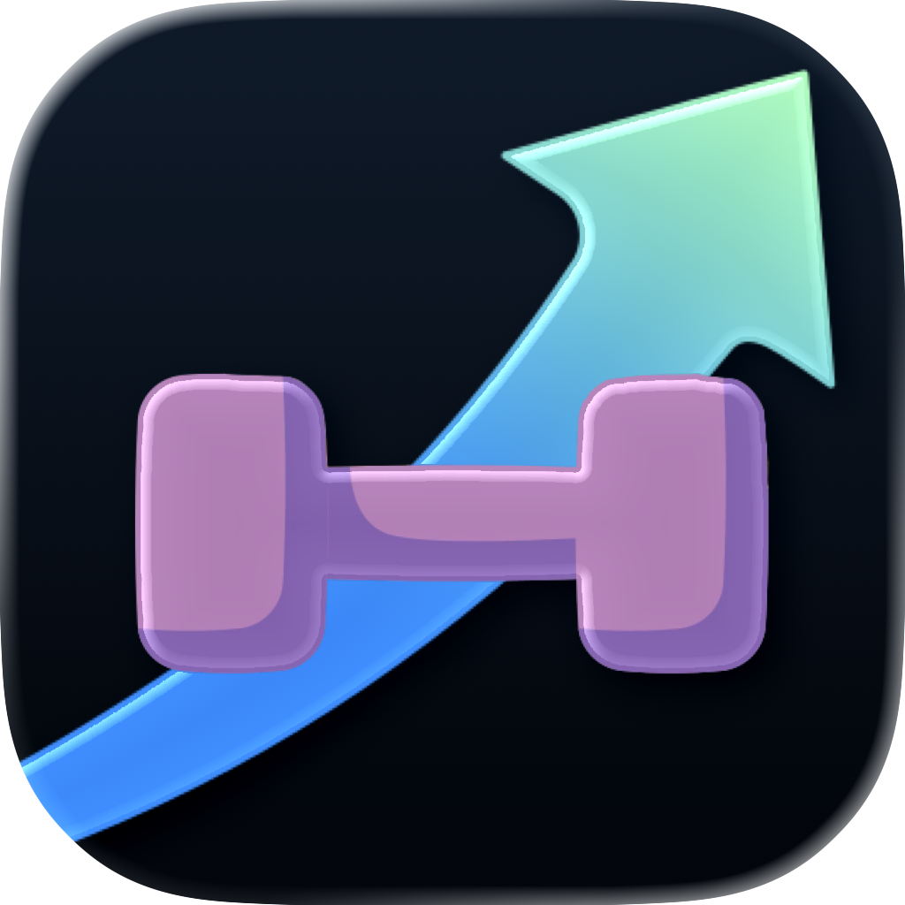
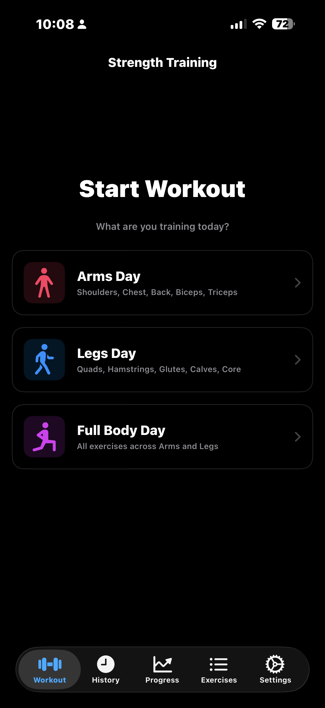
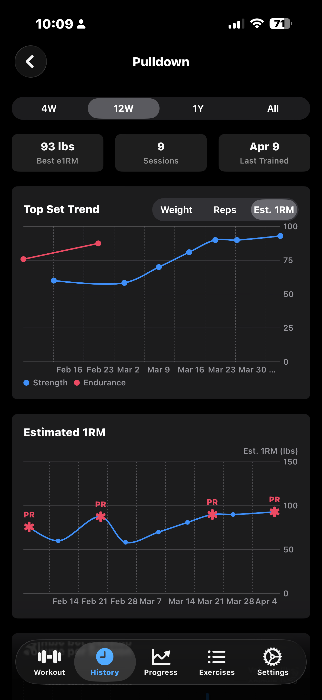
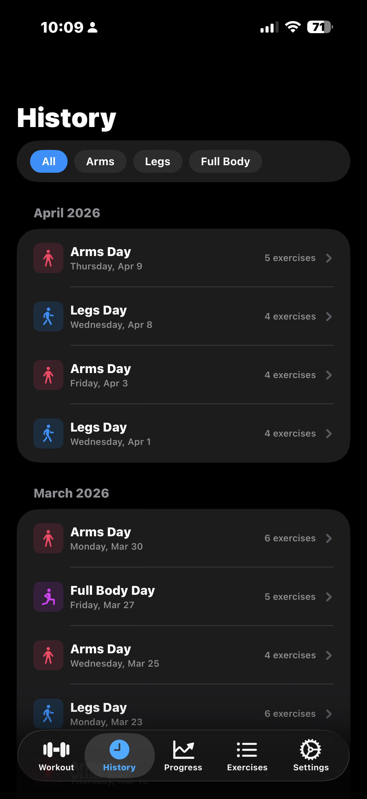
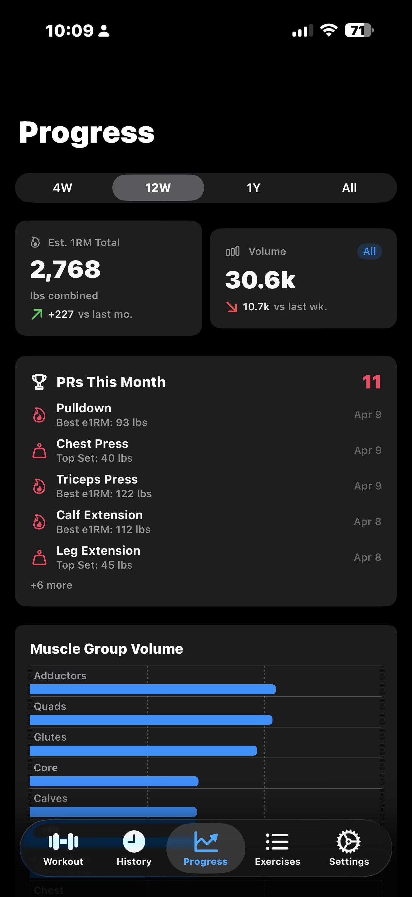
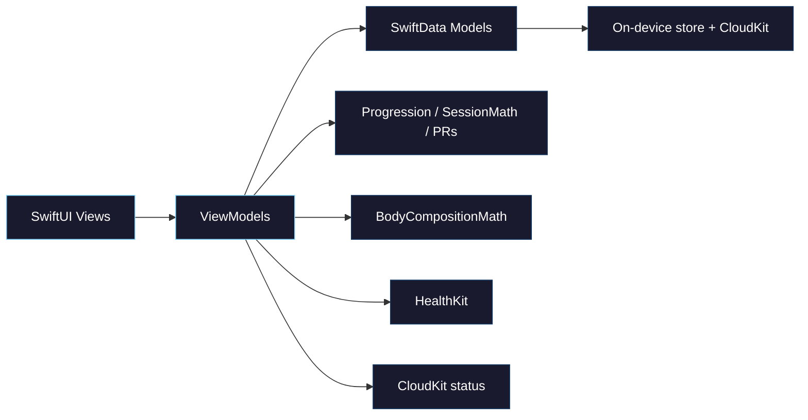

<div align="center">
  
  <h1>RockLog</h1>
  <em>Log the session. Own the data. See the trend.</em>
  <br>
  <em>A native iOS strength tracker — SwiftUI · SwiftData · built for how people actually train.</em>
  <br><br>

  
  
  
  
  
</div>

---

## Origin & credit

**RockLog is a continuation of work started by [Daniel Kuhlwein](https://github.com/danielkuhlwein).**

Daniel designed and shipped the **original strength-training app**: the architecture, core logging model, progression engine, progress visualization direction, HealthKit/CloudKit foundations, backup path, and design-system bones. That is the **previous distro** this repo stands on. Most of the structure you still navigate every day is his.

This fork (**RockLog**) is maintained by [Lee Brock](https://github.com/brockleej) as a personal hobby log — branding, training-style features, and day-to-day polish layered **on top of** that foundation. **Credit for the original product and framework belongs to Daniel.** Lee is not claiming authorship of that core work.

| | Role |
| --- | --- |
| **[Daniel Kuhlwein](https://github.com/danielkuhlwein)** | **Original author** — app architecture, core product, progression, HealthKit/CloudKit/backup foundations, design-system direction |
| **[Lee Brock](https://github.com/brockleej)** | Maintainer of this fork (RockLog branding, freeform training UX, body metrics, gym pass, session-flow polish) |
| **[Grok](https://x.ai)** (xAI) | Pair-programming collaborator on later features, refactors, and docs |

> [!NOTE]
> **RockLog** (this fork) is a hobby project shaped around real gym use: freeform splits, assisted lifts, rest habits, body measurements / FFMI, gym pass, dark UI. Data is on-device (SwiftData) with optional **iCloud sync**. Export a JSON backup anytime.

---

## What’s from the previous distro (Daniel)

These are the backbone of the app — **originating with the original project**, even where this fork has since renamed, restyled, or extended them:

### Architecture & platform
- **MVVM + SwiftUI + SwiftData** app structure and dependency injection patterns
- **Core models** — `Exercise`, `WorkoutSession`, `ExerciseRecord`, `SetRecord` and cascade relationships
- **Schema / seed catalog** for stock exercises
- **Shared progression algorithm** (`Shared/Algorithm/`, pure functions + types)
- **ProgressionLab** (macOS) for visualizing/tuning progression
- **JSON backup export / restore** pipeline
- **HealthKit** workout start/stop and effort rating path
- **CloudKit / iCloud** integration path (enable/disable, container-oriented setup)
- **Design-system direction** — tokenized surfaces, shared components, dark “refined” aesthetic roots
- **Haptics**, glass-style headers, and general native-feel UI approach

### Product capabilities (original)
- **Workout logging** — weight, reps, sets, warm-ups
- **Training modes** — strength vs endurance (high weight / low reps vs the reverse)
- **Progressive overload suggestions** and aggressiveness settings
- **E1RM** (Epley) estimates and **PR** detection / celebration concepts
- **History** — completed sessions list and session detail
- **Progress tab** — dashboard, charts, exercise drill-down foundation
- **Exercise library** — catalog + custom exercises, day assignment (as originally modeled)
- **Day types** and multi-day training structure (as first shipped)
- **Today / start-session** flow and active-session management
- **Settings** surface for preferences and data management

If you are evaluating “who built the app,” start here: **the previous distro is the product’s spine.**

---

## What’s added or heavily evolved in RockLog (this fork)

Layered on the foundation above for a more freeform, physique-aware gym log:

### Training & session UX
- **Freeform training splits** — user-defined ordered day types (`SplitDay`), presets, icons/colors
- **Rolling vs weekly schedule** modes
- **A/B rotation tracks** on exercises and sessions
- **Focus flow** overhaul — multi-lift navigation, **last-vs-this** set rows, superscript weight/rep deltas
- **Explicit “Done with this lift”** (any set count) + **Next** that skips only marked-done lifts
- **Finish prompt** when every lift is marked done
- **Swipe to delete** an extra logged set
- **Per-exercise notes** — difficulty / next time / modifications (Focus + Edit)
- **Rest timer** — defaults + **per-exercise** on/off (supersets), countdown sounds
- **Assisted lifts** — assist amount, effective load for volume/e1RM everywhere
- **Each-side** volume doubling
- **History reopen for edit** without dropping the session from History
- **Gym pass** — membership barcode from Today

### Body & progress
- **Body metrics** log (weight, waist, neck, chest, arm, hips)
- **US Navy body-fat → FFMI** muscularity index, bands, trends
- Height / sex profile wiring for composition math
- Progress dashboard polish and range/lift presentation (built on the original Progress tab)

### Brand, design, ops
- **RockLog** name (App Store: *RockLog* · subtitle e.g. *Strength training gym log*), icon (Icon Composer), launch screen
- **Uplift / Refined Native** token polish (ice accent, `Num`/mono stats, list mutation patterns)
- **CloudKit re-enable** for paid team (`iCloud.com.lee.lift2026`), sync status UI, post-import seed dedupe
- TestFlight / Xcode Cloud oriented workflow notes for this fork’s `main`

Many UI screens still **sit on original ViewModels and services**; RockLog changes are often presentation, product rules, and new models (e.g. body metrics, split days) rather than a greenfield rewrite.

---

## Why this fork exists

| Problem | Approach in RockLog |
| --- | --- |
| Rigid programs | Freeform splits and day plans |
| Logging mid-set is awkward | Focus flow, steppers, Done / Next |
| Assisted work breaks math | Assist flag + effective load |
| Physique tracking is separate | Body metrics + FFMI |
| Membership card is another app | Gym pass |

## Screenshots

> Current PNGs are **stale** (pre–build 8 UI). Recapture for README + App Store — see [docs/SCREENSHOTS.md](docs/SCREENSHOTS.md).

<p align="center">
  
  
  
  
</p>

## Feature map (full product)

### Training session
- **Today** — day picker, week rotation (A/B/All), resume or start, gym pass  
  *(day/start session: previous distro · split/rotation/pass: RockLog)*
- **Exercise list** — overview, recipe/target secondary line, progress by **marked-done** lifts  
  *(list foundation: previous distro · done tracking: RockLog)*
- **Focus** — weight × reps steppers, strength/endurance mode, last-vs-this, Warm · Log · Done  
  *(logging core: previous distro · layout / done / last-vs-this: RockLog)*
- **Rest timer**, **assist**, **each-side** — RockLog
- **Progression suggestions**, **PR celebration**, **HealthKit** — previous distro (still central)

### History
- List + detail, volume/PR callouts — **previous distro**
- Safe reopen-for-edit — **RockLog**

### Progress & body
- Dashboard, charts, drill-down — **previous distro** (evolved in both)
- Body metrics + Navy/FFMI — **RockLog**

### Library & settings
- Exercise library, backup, HealthKit settings, progression aggressiveness — **previous distro**
- Freeform split editor, rest timer prefs, body profile, gym pass, iCloud status polish — **RockLog**

### Design
- Tokenized dark UI direction — **previous distro**
- RockLog branding, ice uplift polish, list mutation conventions — **RockLog**

## Architecture

**MVVM** with SwiftUI `@Observable` ViewModels and SwiftData — as established in the original app.


```mermaid
graph LR
    A["SwiftUI Views"] --> B["ViewModels"]
    B --> C["SwiftData Models"]
    B --> F["Progression / SessionMath / PRs"]
    B --> G["BodyCompositionMath"]
    B --> E["HealthKit"]
    B --> K["CloudKit status"]
    C --> D["On-device store + CloudKit"]

    style A fill:#1a1a2e,stroke:#7dd3fc,color:#fff
    style B fill:#1a1a2e,stroke:#7dd3fc,color:#fff
    style C fill:#1a1a2e,stroke:#0f3460,color:#fff
    style D fill:#1a1a2e,stroke:#0f3460,color:#fff
    style E fill:#1a1a2e,stroke:#0f3460,color:#fff
    style F fill:#1a1a2e,stroke:#0f3460,color:#fff
    style G fill:#1a1a2e,stroke:#0f3460,color:#fff
    style K fill:#1a1a2e,stroke:#0f3460,color:#fff
```

| Layer | Role |
| --- | --- |
| **Views** | UI only; bind to VMs / `@Query` |
| **ViewModels** | Feature state; `ModelContext` injected |
| **Models** | SwiftData `@Model` graph; cascade deletes on parents |
| **Services** | Progression, E1RM, PRs, rest timer, Navy/FFMI, HealthKit, CloudKit, backup, schedule |
| **DesignSystem** | Shared tokens and components |

**Stack:** Swift 6 · iOS 26.2+ · Xcode 16+ · SwiftUI · SwiftData · Swift Charts · HealthKit · CloudKit  
**App Store name:** RockLog · **Home screen:** RockLog · **Bundle ID:** `com.lee.lift2026` (unchanged)  
**Suggested subtitle:** Strength training gym log  
**Sync (this fork):** `cloudKitDatabase: .automatic`, container `iCloud.com.lee.lift2026`  
**Icon (this fork):** Icon Composer bundle `strength_training.icon`

## Getting started

### Prerequisites
- Xcode 16+
- iOS 26.2+ simulator or device
- Apple Developer team for device / TestFlight / CloudKit

### Build & run

```bash
git clone https://github.com/brockleej/strength-training.git
cd strength-training

open strength-training.xcodeproj
# or
xcodebuild -scheme strength-training -destination 'platform=iOS Simulator,name=iPhone 17'
```

Set your **signing team** on the app target → Signing & Capabilities, then Run.

### Tests

```bash
xcodebuild test -scheme strength-training -destination 'platform=iOS Simulator,name=iPhone 17'
```

### ProgressionLab (macOS, local only)

Part of the **original** project — visualizer/tuner for the progression algorithm. Not on TestFlight.

```bash
xcodebuild -scheme ProgressionLab -destination 'platform=macOS' build
xcodebuild test -scheme ProgressionLab -destination 'platform=macOS'
```

### Local caveats
| Feature | Note |
| --- | --- |
| **HealthKit** | Physical device |
| **CloudKit** | Paid team, iCloud entitlement, signed-in iCloud |
| **Backup** | Settings → Export before risky restores |

## TestFlight

**Xcode Cloud** on this fork ships every push to **`main`** to internal TestFlight.

Request beta access via [Issues](https://github.com/brockleej/strength-training/issues).

## Project layout

```
strength-training/
├── Models/           # Core graph (original) + SplitDay, BodyMetricEntry (RockLog)
├── ViewModels/       # Feature VMs (original pattern; new VMs for body metrics, etc.)
├── Views/
│   ├── Today/ Workout/ History/ Progress/ Library/ Settings/
│   └── DesignSystem/ # Token/component system (original direction, RockLog polish)
├── Services/         # Progression, HK, backup (original) + rest, body, gym pass (RockLog)
├── Utilities/
├── strength_training.icon/   # RockLog
└── LaunchScreen.storyboard
Shared/Algorithm/     # Progression pure core — previous distro
progression-lab/      # macOS tool — previous distro
strength-training-tests/
```

Agent notes: [CLAUDE.md](CLAUDE.md).

## Contributing

- Conventional commits: `feat:`, `fix:`, `refactor:`, `docs:`, …
- Focused PRs
- Respect the architecture Daniel established (MVVM + `@Observable` + SwiftData) — see [CLAUDE.md](CLAUDE.md)
- Prefer real gym workflows over generic “fitness app” checklists
- **Pushes to `main` auto-deploy to TestFlight** on this fork

## License

MIT — use, fork, and build on it.

**Please preserve credit for the original strength-training work by [Daniel Kuhlwein](https://github.com/danielkuhlwein).** This repository continues that lineage under the name **RockLog**.
