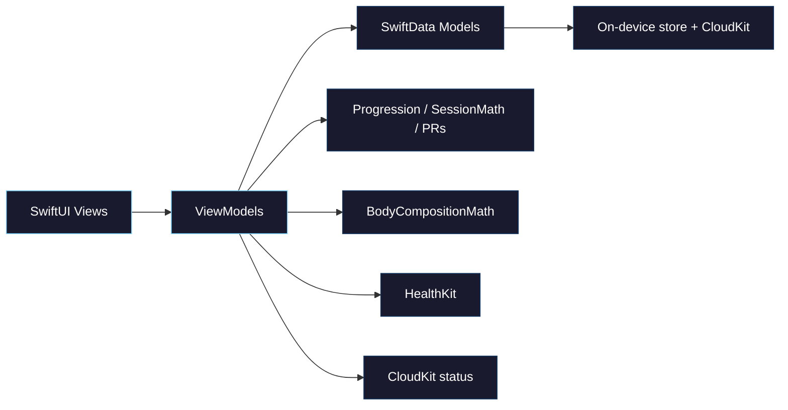

<div align="center">
  
  <h1>IronLog</h1>
  <em>Log the session. Own the data. See the trend.</em>
  <br>
  <em>A native iOS strength tracker — SwiftUI · SwiftData · built for how people actually train.</em>
  <br><br>

  
  
  
  
  
</div>

---

> [!NOTE]
> **IronLog** is a **hobby project** by [Lee Brock](https://github.com/brockleej) for personal training logs and metrics. The product shape — freeform splits, assisted lifts, rest-timer habits, body measurements / FFMI, gym pass, and a dark “refined native” UI — matches **how this app is actually used in the gym**, not a generic fitness checklist. Data is on-device (SwiftData) with optional **iCloud sync**. Export a JSON backup anytime.

## Why IronLog

| Problem | What IronLog does |
| --- | --- |
| Apps force rigid programs | **Freeform splits** — Push/Pull/Legs, bro, custom day names; reorder and assign freely |
| Logging fights you mid-set | **Focus flow** — steppers, warm/log/done, next unfinished lift, last-vs-this set rows |
| Assisted work breaks volume math | **Assist flag** — store machine assist; tonnage / e1RM use body weight − assist |
| Progress is opaque | **Dashboard + drill-down** — volume, e1RM, PRs, muscle groups, mode split |
| Physique tracking is separate | **Body metrics** — Navy BF% → **FFMI** bands and trends |
| Membership card is another app | **Gym pass** — barcode from Today |

## Screenshots

<p align="center">
  
  
  
  
</p>

## Features

### Training session
- **Today home** — day picker, week rotation (A/B/All), resume or start, gym pass shortcut
- **Exercise list** — session overview, last-session recipe or progression target, progress by lifts *you marked done*
- **Focus screen** — log weight × reps with ice-tinted steppers; strength / endurance mode
- **Last vs this** — prior session set inline with this session; superscript Δ on weight or reps
- **Warm · Log set · Done** — warm-up flag, log/update set, **Done with this lift** (any set count — stop early or keep going)
- **Next unfinished** — advance past lifts you marked done; wraps to remaining open lifts
- **Rest timer** — global default + **per-exercise** on/off (supersets); optional countdown ticks / complete sound
- **Assisted lifts** — assist amount on the stepper; volume and e1RM use effective load
- **Each-side** — double volume for unilateral work
- **Progressive overload** — suggestions from recent history (aggressiveness in Settings)
- **PR celebration** — e1RM breakthroughs mid-session (not while editing History)
- **HealthKit** — live workout ring, effort rating on finish (device required)

### History & edits
- **Session history** — month sections, volume, PR callouts
- **Session detail** — set-by-set breakdown, HealthKit stats when linked
- **Edit past workouts** — reopen from History; stays listed while you edit; Save / Exit without deleting the session

### Progress & body
- **Dashboard** — headline volume, strength score, PRs this month, charts (volume, muscle group, mode split), lift progression
- **Exercise drill-down** — top-set bars, e1RM trend, personal best, recent sessions
- **Body metrics** — weight, waist, neck, chest, arm, hips (sex-aware Navy sites)
- **Muscularity** — US Navy body-fat estimate → **FFMI** with band labels; trends
- **Height & sex** in Settings; body weight syncs for assisted-load math

### Split, library, settings
- **Training split** — ordered day types, icons/colors, presets (e.g. bro / PPL) or fully custom
- **Rolling or weekly schedule** — advance after sessions, or calendar week
- **Exercise library** — catalog + custom lifts, multi-day membership, A/B rotation labels, day-plan reorder
- **Gym pass** — membership barcode/ID, bright scan screen
- **Backup** — JSON export / restore
- **iCloud Sync** — status in Settings; pull to refresh account state

### Design
- Dark **Refined Native** system — ice accent, continuous-corner cards, tabular stats (`Num` / mono)
- Shared list patterns (soft remove vs hard delete + confirm, long-press reorder)
- App locked to dark mode with ice tint

## Architecture

**MVVM** with SwiftUI `@Observable` ViewModels and SwiftData.


```mermaid
graph LR
    A["SwiftUI Views"] --> B["ViewModels"]
    B --> C["SwiftData Models"]
    B --> F["Progression / SessionMath / PRs"]
    B --> G["BodyCompositionMath"]
    B --> E["HealthKit"]
    B --> K["CloudKit status"]
    C --> D["On-device store + CloudKit"]

    style A fill:#1a1a2e,stroke:#7dd3fc,color:#fff
    style B fill:#1a1a2e,stroke:#7dd3fc,color:#fff
    style C fill:#1a1a2e,stroke:#0f3460,color:#fff
    style D fill:#1a1a2e,stroke:#0f3460,color:#fff
    style E fill:#1a1a2e,stroke:#0f3460,color:#fff
    style F fill:#1a1a2e,stroke:#0f3460,color:#fff
    style G fill:#1a1a2e,stroke:#0f3460,color:#fff
    style K fill:#1a1a2e,stroke:#0f3460,color:#fff
```

| Layer | Role |
| --- | --- |
| **Views** | UI only; bind to VMs / `@Query` |
| **ViewModels** | Feature state; `ModelContext` injected — never grab context from views |
| **Models** | SwiftData `@Model` graph with cascade deletes on parents |
| **Services** | Progression, E1RM, PRs, rest timer, Navy/FFMI, HealthKit, CloudKit, backup, schedule |
| **DesignSystem** | `Color.uplift.*`, `Font.uplift.*`, shared components |

**Stack:** Swift 6 · iOS 26.2+ · Xcode 16+ · SwiftUI · SwiftData · Swift Charts · HealthKit · CloudKit  
**Sync:** `cloudKitDatabase: .automatic`, container `iCloud.com.lee.lift2026`  
**Icon:** Icon Composer bundle `strength_training.icon` (no PNG appiconset pipeline)

## Getting started

### Prerequisites
- Xcode 16+
- iOS 26.2+ simulator or device
- Apple Developer team for device / TestFlight / CloudKit

### Build & run

```bash
git clone https://github.com/brockleej/strength-training.git
cd strength-training

open strength-training.xcodeproj
# or
xcodebuild -scheme strength-training -destination 'platform=iOS Simulator,name=iPhone 17'
```

Set your **signing team** on the app target → Signing & Capabilities, then Run.

### Tests

```bash
xcodebuild test -scheme strength-training -destination 'platform=iOS Simulator,name=iPhone 17'

# One class
xcodebuild test -scheme strength-training \
  -destination 'platform=iOS Simulator,name=iPhone 17' \
  -only-testing:strength-training-tests/FocusTargetLogicTests
```

### ProgressionLab (macOS, local only)

Visualizer / tuner for the progression algorithm. **Not** on TestFlight.

```bash
xcodebuild -scheme ProgressionLab -destination 'platform=macOS' build
xcodebuild test -scheme ProgressionLab -destination 'platform=macOS'
```

### Local caveats
| Feature | Note |
| --- | --- |
| **HealthKit** | Physical device |
| **CloudKit** | Paid team, iCloud entitlement, signed-in iCloud; container `iCloud.com.lee.lift2026` |
| **Backup** | Settings → Export before risky restores or major experiments |

## TestFlight

**Xcode Cloud** ships every push to **`main`** to internal TestFlight. Treat `main` as release.

Request beta access via [Issues](https://github.com/brockleej/strength-training/issues).

## Project layout

```
strength-training/
├── Models/           # Exercise, WorkoutSession, ExerciseRecord, SetRecord,
│                     # SplitDay, BodyMetricEntry, SeedData, day/rotation types
├── ViewModels/       # Workout, History, Progress, Body metrics, Drill-down
├── Views/
│   ├── Today/        # Home, day picker, week strip
│   ├── Workout/      # List, Focus flow, sets, rest, PRs, summary
│   ├── History/      # Sessions + detail + reopen for edit
│   ├── Progress/     # Dashboard, charts, body metrics
│   ├── Library/      # Exercises, day plan editor
│   ├── Settings/     # Split, rest, body, gym pass, iCloud, backup
│   └── DesignSystem/ # Tokens, typography, components
├── Services/         # Progression, E1RM, PRs, SessionMath, rest timer,
│                     # Navy/FFMI, HealthKit, CloudKit, backup, schedule
├── Utilities/        # Preview sample data
├── strength_training.icon/
└── LaunchScreen.storyboard
Shared/Algorithm/     # Progression types shared with ProgressionLab
strength-training-tests/
progression-lab/      # macOS dev tool (separate scheme)
```

Agent-oriented architecture notes: [CLAUDE.md](CLAUDE.md).

## Recent work (high level)

This branch of development has focused on **reliability under real gym use** and a clearer session UI:

- **iCloud / CloudKit** re-enabled with container wiring, sync event observation, post-import seed dedupe
- **Assisted-lift math** — e1RM, volume, Progress, and History use effective load consistently
- **History edit safety** — reopen never hides/deletes the session; edit in place while completed
- **Focus sets** — last-vs-this row layout; deltas next to weight or reps
- **Session navigation** — Next skips only lifts you **mark Done**; Done is explicit (not “matched last time’s set count”)
- **UI polish** — compact Warm · Log · Done row; list progress tracks marked-done lifts

## Authors & acknowledgments

Built on a strong foundation. **Significant gratitude** to **[Daniel Kuhlwein](https://github.com/danielkuhlwein)** for the **initial app**: organization, MVVM + SwiftData, progression engine, design-system direction, HealthKit/CloudKit wiring, and the structure that made IronLog possible to extend.

| Author | Role |
| --- | --- |
| **[Daniel Kuhlwein](https://github.com/danielkuhlwein)** | Original app, organization, and framework |
| **[Lee Brock](https://github.com/brockleej)** | Maintainer; IronLog branding, training-style features, body metrics, product direction |
| **[Grok](https://x.ai)** (xAI) | Co-author / pair-programming collaborator on features, refactors, docs, and day-to-day development |

## Contributing

- Conventional commits: `feat:`, `fix:`, `refactor:`, `docs:`, …
- Focused PRs (one feature or fix)
- MVVM + `@Observable` — see [CLAUDE.md](CLAUDE.md)
- Prefer real gym workflows over generic “fitness app” checklists
- **Pushes to `main` auto-deploy to TestFlight** — use a PR when you want review first

## License

MIT — use, fork, and build on it.

Upstream roots live in the original strength-training work by Daniel Kuhlwein; this lineage continues as **IronLog**.
